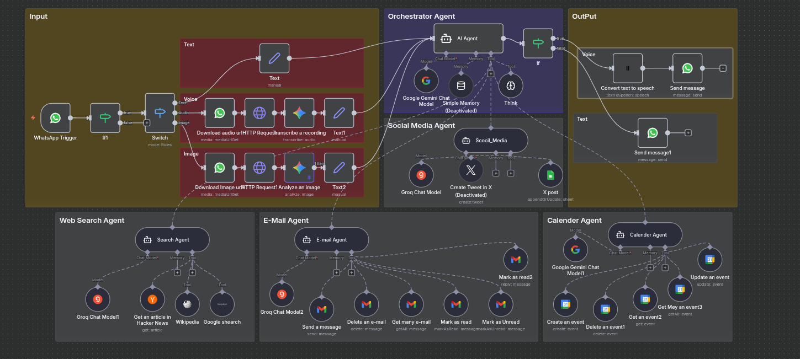

# WhatsApp Multi-Agent Orchestrator  
### (Supports Text, Voice & Images)

> 🌍 [Read this in Arabic](README_ar.md)

---
# WhatsApp Multi-Agent Orchestrator    
### (Supports Text 📝, Voice 🎙️, and Images 🖼️)

🤖 An intelligent WhatsApp assistant that understands **text messages, voice notes, and images**, routes each request to specialized AI agents, and responds with **text, voice, or contextual insights**.

---

## 🌟 Features

- ✅ **Supports 3 input types**:
  - 📝 **Text messages**: _"Search the latest AI news"_
  - 🎙️ **Voice messages**: Auto-transcribed, processed, and replied via voice or text
  - 🖼️ **Images**: Analyzed using AI vision (OCR, object detection, captioning)
- ✅ **Smart routing to specialized agents**:
  - 🔍 **Search Agent**: Fetches real-time web data
  - 📧 **Gmail Agent**: Reads, sends, and manages emails
  - 🗓️ **Calendar Agent**: Creates and retrieves events
  - 📱 **Social Media Agent**: Drafts and schedules posts
  - 🖼️ **Vision Agent**: (New!) Describes images, extracts text (OCR), detects content
  - 🧠 **ThnIK Tool**: Handles logic and routing decisions
- ✅ **Voice replies** via ElevenLabs TTS + optimized to `.opus` for WhatsApp/web
- ✅ **Plain-text fallback** for API compatibility

---

## 🧠 How It Works

| Input Type | Processing | Output |
|-----------|------------|--------|
| **Text** | Routed directly to the relevant agent | Text or voice |
| **Voice** | Speech-to-Text → Agent routing → Text-to-Speech | Voice message |
| **Image** | AI Vision analysis (OCR/Captioning) → Contextual response | Text or voice |

### Example: Image Processing
- **User sends**: A photo of an electricity bill  
- **System**:  
  1. Extracts text using OCR  
  2. Detects it’s an invoice  
  3. Routes to Gmail Agent to email it to the accountant  
  4. Replies: *"Invoice received and forwarded to your accountant."* (as text or voice)

---

## 🛠️ Tech Stack

- **n8n** – Workflow automation engine
- **ElevenLabs** – High-quality Text-to-Speech (TTS)
- **OpenAI Whisper / AssemblyAI** – Speech-to-Text (STT)
- **Google Vision / Azure Computer Vision / GPT-4V** – Image analysis & OCR
 - **WhatsApp Business API** (e.g., WhatsApp Cloud API, Twilio)

---

## 📁 Project Files

- ` WAgentEnhancementMultiAgent-1.json` – Full n8n workflow (supports text, voice, images)
- `screan.png` – Screenshot of the workflow in n8n editor
- `README.md` – This file

---

## 💡 Real-World Use Cases

- 🗣️ **User sends voice**: _"What’s my meeting time tomorrow?"_ → System replies with a **voice message**.
- 📸 **User sends product image**: _"What’s the price of this?"_ → System describes the item and searches for pricing.
- 📝 **User types text**: _"Send the sales report to Ahmed"_ → System generates and emails the report.

---

> 💡 Designed for developers, support teams, and entrepreneurs who want to turn **WhatsApp into a multimodal AI command center**.
